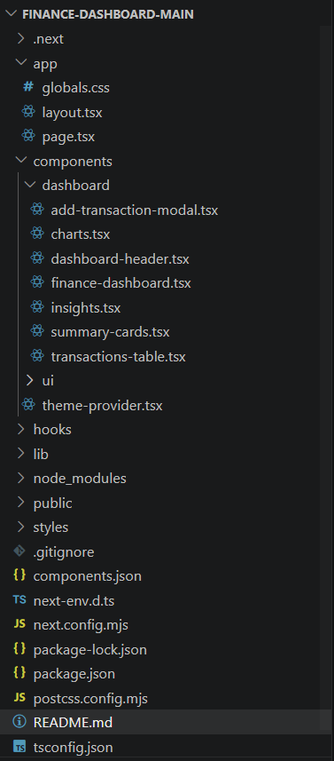
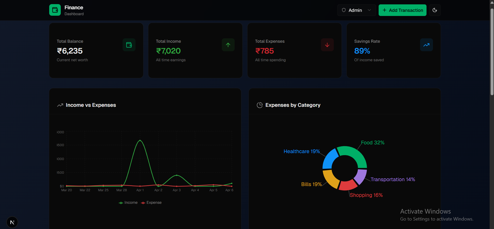
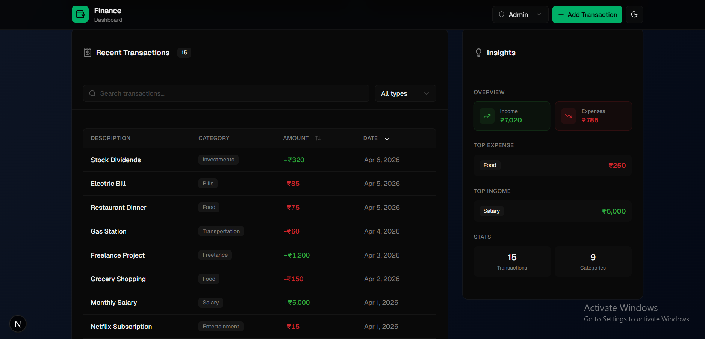

# 💰 Finance Dashboard UI

A modern, responsive finance dashboard built using Next.js, React, and Tailwind CSS.
This application allows users to track financial activity, analyze spending patterns, and interact with data through a clean and intuitive interface.

---

## 🚀 Features

### 📊 Dashboard Overview

* Summary cards for:

  * Total Balance
  * Total Income
  * Total Expenses
* Interactive charts:

  * Line chart for balance trends
  * Pie chart for spending breakdown

### 💳 Transactions Management

* View all transactions with:

  * Date
  * Amount
  * Category
  * Type (Income / Expense)
* Features:

  * Search by category
  * Filter by transaction type
  * Sorting (amount/date)
  * Add new transactions (Admin only)

### 🔐 Role-Based UI

* **Viewer**:

  * Can only view data
* **Admin**:

  * Can add transactions
* Role switching via dropdown for demonstration

### 📈 Insights

* Highest spending category
* Income vs Expense comparison
* Useful financial observations

---

## 🎨 UI & UX Highlights

* Clean, modern SaaS-style design
* Responsive across devices (mobile, tablet, desktop)
* Dark mode support 🌙
* Smooth hover animations using Framer Motion
* Well-structured layout with reusable components

---

## 🧠 Tech Stack

* **Framework**: Next.js (React)
* **Language**: TypeScript
* **Styling**: Tailwind CSS
* **Charts**: Recharts
* **UI Components**: shadcn/ui
* **State Management**: React Hooks (useState, useMemo)

---

## 🏗️ Project Structure




## 🖼️ Dashboard Preview




---

## ⚙️ Setup Instructions

1. Clone the repository:

```
git clone https://github.com/pratyushsingh8/finance-dashboard.git
cd finance-dashboard
```

2. Install dependencies:

```
npm install
```

3. Run the development server:

```
npm run dev
```

4. Open in browser:

```
http://localhost:3000
```

---

## 🌐 Deployment

The project can be easily deployed using platforms like Vercel.

```
npm run build
```

---

## 🧪 Assumptions & Approach

* Used mock data to simulate financial transactions
* Focused on frontend functionality and user experience
* Role-based access is simulated on the frontend (no backend)
* Prioritized clean UI, modular structure, and responsiveness

---

## 🔮 Future Improvements

* Backend integration (database + APIs)
* Authentication system
* Advanced analytics & reports
* Export data (CSV/JSON)
* Real-time updates

---

## 🙌 Acknowledgment

This project was built as part of a frontend developer assignment to demonstrate UI design, state management, and interactive dashboard development skills.

---

## 📬 Contact

If you have any questions or feedback, feel free to reach out.

---

⭐ If you like this project, consider giving it a star!
